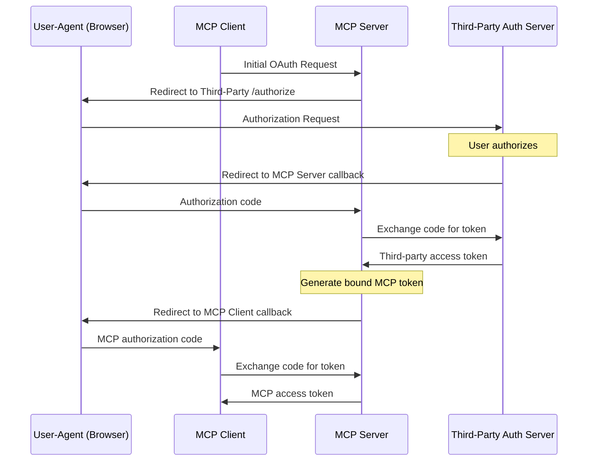

测试 mermaid 效果

```mermaid
sequenceDiagram
    participant B as User-Agent (Browser)
    participant C as MCP Client
    participant M as MCP Server
    participant T as Third-Party Auth Server

    C->>M: Initial OAuth Request
    M->>B: Redirect to Third-Party /authorize
    B->>T: Authorization Request
    Note over T: User authorizes
    T->>B: Redirect to MCP Server callback
    B->>M: Authorization code
    M->>T: Exchange code for token
    T->>M: Third-party access token
    Note over M: Generate bound MCP token
    M->>B: Redirect to MCP Client callback
    B->>C: MCP authorization code
    C->>M: Exchange code for token
    M->>C: MCP access token
```