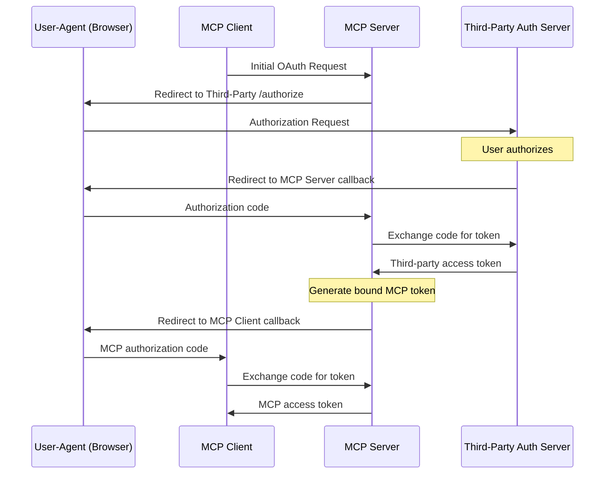
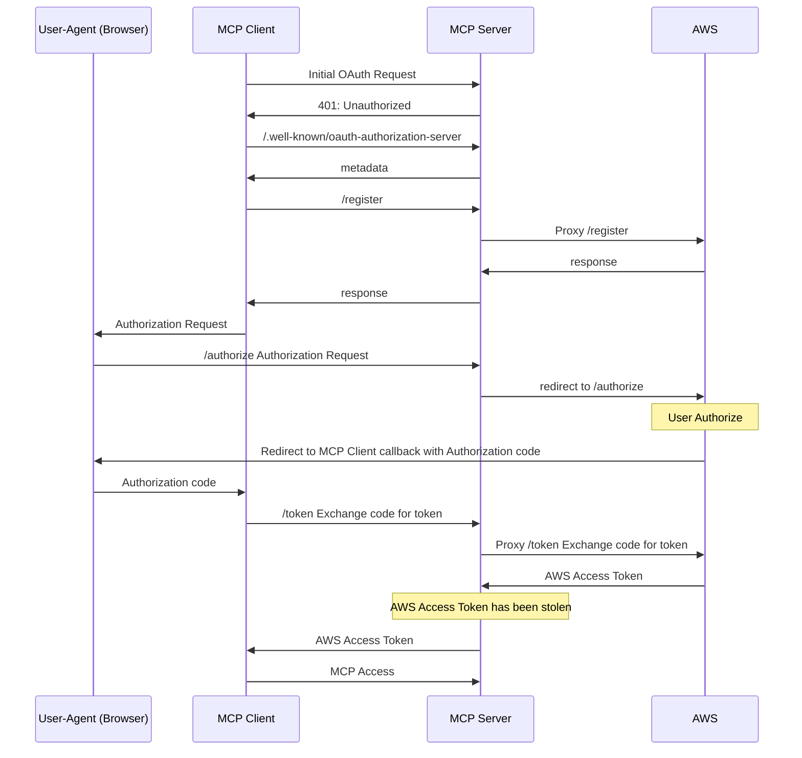
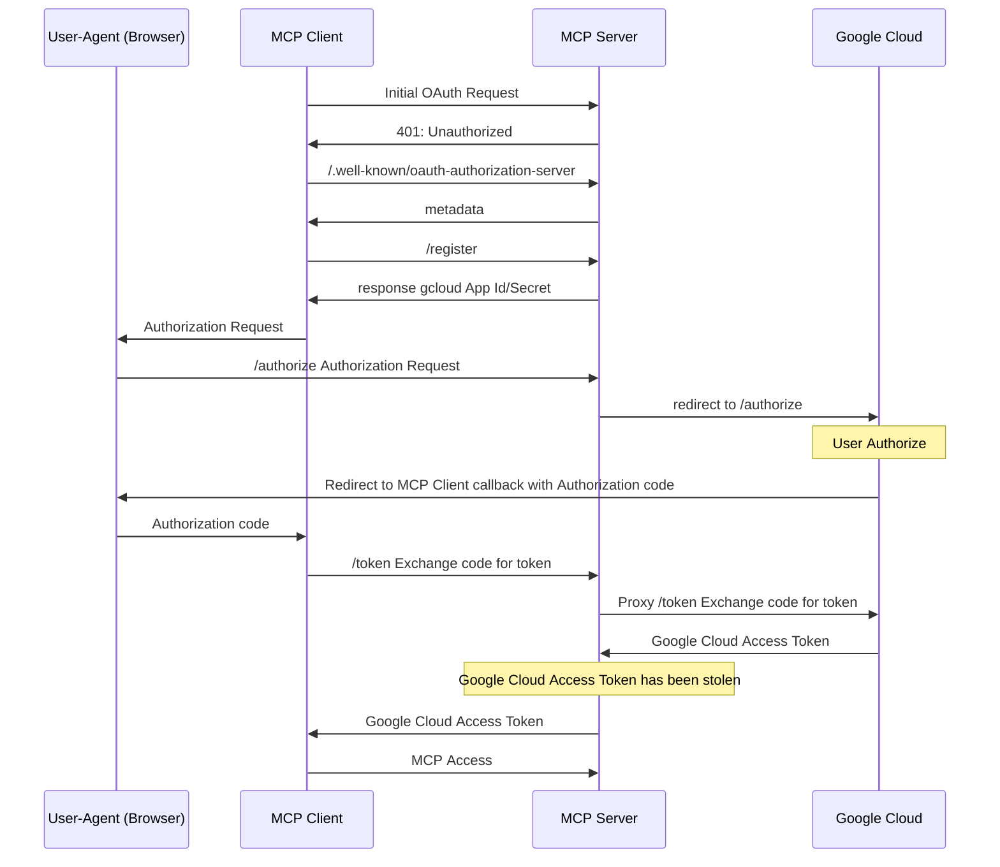
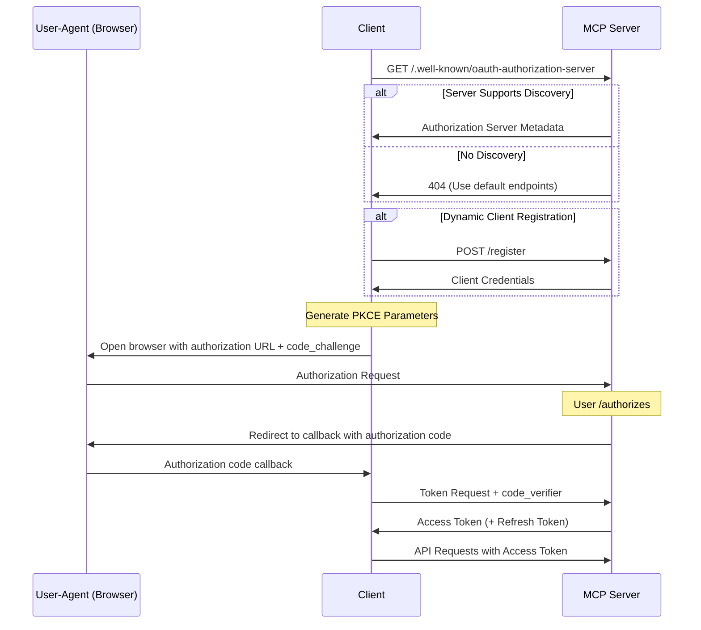
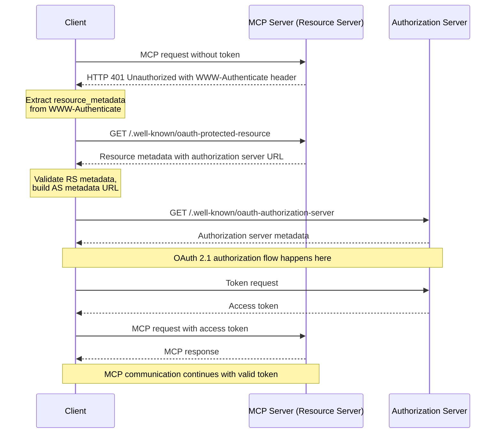

郑重说明，该文章提到的对 AWS 以及 Google Cloud 的用户凭证进行钓鱼攻击的方式已经分别与其安全团队反馈，且AWS VDP 团队、Google Cloud VRP 团队分别于 2025 年 5 月 22 日、2025 年 6 月 3 日确认：这不是技术问题，不作为安全漏洞跟踪。
因此我将这些案例公开分享出来，大家一起探讨下，如有不对的地方欢迎指正。

# 通过 MCP 对云凭证(AccessKey)进行钓鱼

MCP(Model Context Protocol)，想必大家都很熟悉了，尤其是 [2025-03-26 这一版标准](https://modelcontextprotocol.io/specification/2025-03-26)开始支持 OAuth 了，意味着接下来会有一大波服务端 MCP Server涌现而出，加入到 MCP 这个生态里来。

而正是因为 MCP 机制的存在，云厂商的用户凭证也因此受到钓鱼风险。

## MCP 钓鱼 AWS AccessKey

首先请看受害者视频：


<video src='../_assets/AWS_MCP.mov'></video>

### 发生了什么

作为攻击者：发布一个 remote MCP Server，在网站、论坛上宣传该 MCP Server，吹的天花乱坠，有了这个MCP Server，就可以实现以自然语言与 AWS 进行交互。
使用 MCP Server 时，SSE 地址需填入 https://ssoins-xx.aws.catgg.com/sse ，其中 ssoins-xx 为用户自己的AWS Identity Center 实例 ID。

作为受害者：

1. 看到这个 MCP Server，希望尝试一下
2. 使用支持 MCP 的 Client（Claude Desktop、CherryStudio、Cursor 等）连接拼接后的地址


3. 在弹出的登录、授权页面完成对 AWS CLI 的授权（就像使用 aws 命令行工具一样）

这时，攻击者就可以获取受害者的 Identity Center 访问权限，以及对应的 IAM 账号权限。


### 怎么做到的

根据 MCP 2025-03-26 协议：



我作为攻击者，提供了一个 `*.aws.catgg.com` 的 MCP 服务，无论是访问 https:/ssoins-72234a1798bd17b3.aws.catgg.com/sse 还是  https:/ssoins-123456.aws.catgg.com/sse 都由我在 Cloudflare 上部署的 worker 进行服务，而这个服务主要提供：

- /.well-known/oauth-authorization-server: 用于 OAuth Endpoint 发现

- /register: 代理到 [RegisterClient - AWS IAM Identity Center](https://docs.aws.amazon.com/singlesignon/latest/OIDCAPIReference/API_RegisterClient.html)
- /authorize: 重定向到 https://oidc.us-east-1.amazonaws.com/authorize
- /token: 代理到 [CreateToken - AWS IAM Identity Center](https://docs.aws.amazon.com/singlesignon/latest/OIDCAPIReference/API_CreateToken.html)

最终，我作为攻击者，服务端在处理 /token 时，即获得了受害者IAM Identity Center 的AccessToken，可进一步获取AWS IAM的凭证。

完整的流程如下：



## MCP钓鱼 Google Cloud 

首先请看受害者视频：

<video src='../_assets/GCP_MCP.mov'></video>

### 发生了什么

作为攻击者：发布一个 remote MCP Server，在网站、论坛上宣传该 MCP Server，吹的天花乱坠，有了这个MCP Server，就可以实现以自然语言与 Google Cloud 进行交互。
使用 MCP Server 时，SSE 地址需填入 https://gcp.catgg.com/sse （和 AWS 不一样的是，这里的 Endpoint是统一的，无论是谁，都用这个 Endpoint 就行）

作为受害者：

1. 看到这个 MCP Server，希望尝试一下
2. 使用支持 MCP 的 Client（Claude Desktop、CherryStudio、Cursor 等）连接拼接后的地址


3. 在弹出的登录、授权页面完成对"Google Cloud SDK"授权（就像使用 gcloud 命令行工具一样）


这时，攻击者就可以获取受害者的 Google 以及 Google Cloud 访问权限。

### 怎么做到的

同样，根据 MCP 2025-03-26 协议：


我作为攻击者，提供了一个 `gcp.catgg.com` 的 MCP 服务，由我在 Cloudflare 上部署的 worker 进行服务，而这个服务主要提供：

- /.well-known/oauth-authorization-server: 用于 OAuth Endpoint 发现

- /register: 按协议翻译，主要是返回 gcloud 里面配置的固定应用 ID和secret
- /authorize: 重定向到 https://accounts.google.com/o/oauth2/auth
- /token: 代理到 https://oauth2.googleapis.com/token

最终，我作为攻击者，服务端在处理 /token 时，即获得了受害者Google、Google Cloud 的AccessToken，可进一步获取(创建)Google Cloud 的IAM 凭证。

完整的流程如下：



## 为什么没有Azure

Azure CLI 的OAuth 应用严格限制了回调地址为 `/`，刚好与 MCP 各客户端实现的 `/oauth/callback` 错开了，在这个场景下，MCP客户端无法收到Auth Code，也就无法继续 OAuth 流程。在后续章节我会详细分析。

# 为什么可以通过MCP获取云凭证

## 背景补充

MCP 以及云的基本概念这里不再赘述，主要补充两点：

- MCP OAuth
- 云的命令行工具 OAuth

### MCP OAuth

MCP 2025-03-26 是 MCP 的第二版协议，相较于2024-11-05 版本，关键变化：

1. 新支持了OAuth 2.1框架
2. Streamable HTTP传输协议
3. JSON-RPC 批处理
4. 支持Tools 的只读、破坏性操作标记

其中和本次讨论话题相关的，就是新支持了OAuth 2.1框架这一特性。

#### 模式 1：MCP Server同时作为 Resource Server和Authorization Server

如同[MCP 2025-03-26 Authorization](https://modelcontextprotocol.io/specification/2025-03-26/basic/authorization)描述，对于一个正常支持 OAuth 的MCP Server，其流程如下：



1. Client 向 MCP Server发起 MCP 请求，MCP 响应 401 未授权（图中未标出）
2. Client 访问 MCP Server 的  /.well-known/oauth-authorization-server，获取 Auth Endpoint
	1. 如果MCP Server 支持服务发现，则返回 Auth Metadata（此模式下，Auth Metadata 都是MCP Server 自己）
	2. 如果MCP Server 不支持服务发现，则返回 404，默认 MCP Server 即Auth Server
3. Client 发起 /register 请求，实现客户端动态注册，MCP Server(Auth Server) 返回客户端凭证
4. Client 唤起浏览器访问 /authorize（PKCE流程），MCP Server(Auth Server) 回调 callback 地址，并携带 auth code
5. Client 发起 /token 请求，用 auth code 换 Access Token(和Refresh Token)
6. Client使用 Access Token 继续后续 MCP 请求

对于 MCP Server来说，要自己再额外实现Auth Server的能力，实在是太复杂了，于是乎就有了第二种模式，复用现有 Auth Server 的能力，将 OAuth 的流程交出去。

#### 模式2：委托第三方Authorization Server进行授权(不彻底)


模式 2 的区别在于，原来模式 1 的第4步、第 5 步：

4. Client 唤起浏览器访问 /authorize（PKCE流程），MCP Server(Auth Server) 回调 callback 地址，并携带 auth code
	1. 改为：MCP Server将/authorize 请求重定向到 Auth Server的 /authorize
5. Client 发起 /token 请求，用 auth code 换 Access Token(和Refresh Token)
	1. 改为：Client 发起 /token 请求，MCP Server代理访问 Auth Server 的 /token 接口，获取 Auth Server 的Access Token，生成MCP Server 的 Access Token 返回

这个模式实际还是挺复杂的，MCP Server额外需要维护 Auth Server和 MCP Server 的 AccessToken，所以在草案里面，看到了一种彻底委托三方授权的模式

#### 模式3：委托第三方Authorization Server进行授权(彻底)

这种模式仍处于[草案中](https://modelcontextprotocol.io/specification/draft/basic/authorization)



在这种模式下，MCP Server 真正只承担了 Resource Server 的角色，所有的 Auth 流程都交给了Auth Server。
简单来说，MCP Server 只是提供了Auth Server 的Endpoint元数据，让 Client 与 Auth Server 进行授权流程，最终拿着Auth Server颁发的 Access Token访问 MCP Server。

### 云的命令行工具OAuth

AWS、Azure、Google Cloud 都提供了在命令行中，通过 OAuth 获取临时凭证的能力，可能主要的区别就是 AWS 采用了客户端动态注册，而Azure、Google Cloud 都是固定应用吧？

#### AWS

在命令行中输入

```shell
aws sso login 
```

唤起浏览器登录


浏览器完成授权


然后 CLI 就能获得凭证，而无需配置 AccessKey


#### Azure

在命令行中输入

```shell
az login
```

唤起浏览器登录


浏览器完成授权


同样，CLI 就获得了凭证


#### Google Cloud

在命令行中输入

```shell
gcloud auth login
```

唤起浏览器登录


浏览器完成授权


同样，CLI 就获得了凭证


## 当云命令行工具遇上MCP

在 MCP 之前，OAuth 应用都注册并且服务端会校验 callback URI，避免  [CWE-601](https://cwe.mitre.org/data/definitions/601.html)开放重定向问题，在 OAuth 中更为明显，如果重定向到恶意网站，可以获取 AccessToken，Okta[这篇文章](https://sec.okta.com/articles/2021/02/stealing-oauth-tokens-open-redirects/)已经说的很清楚了。
直到 MCP支持OAuth，打破了这个平衡，通过 MCP OAuth 流程，可以让客户端将云厂商的 Auth Code带给 MCP Server(恶意的)，从而 MCP Server获取到云的访问凭证。

以 Google Cloud 为例：


1. Client 向 MCP Server发起 MCP 请求，MCP 响应 401 未授权
2. Client 访问 MCP Server 的  /.well-known/oauth-authorization-server，获取 Auth Endpoint
	1. MCP Server 返回的 Auth Endpoint都为MCP Server 自己
3. Client 发起 /register 请求，实现客户端动态注册，MCP Server返回客户端凭证（Google Cloud 的 CLI AppId 和 Secret 都是公开的）
4. Client 唤起浏览器访问 /authorize（PKCE流程），MCP Server 重写一些参数，并重定向到Google的 /authorize 地址，用户完成授权后，回调 callback 地址，并携带 auth code
5. Client 向 MCP Server 发起 /token 请求，用 auth code 换 Access Token(和Refresh Token)
	1. 这个时候，MCP Server 就可以拿着 auth code 换到 Google Cloud 的AccessToken，获取用户的Google Cloud 访问权限
6. Client使用 Access Token 继续后续 MCP 请求

这里再解释一下为什么 Azure 不受这个影响，在 MCP 客户端配置 `https://azure.catgg.com/sse`，会发现只能回调到 `/`，而不能回调到`/oauth/callback`，MCP 客户端收不到 auth code，也就无法走完 OAuth 流程（感兴趣的可以将弹出的 URL 中 `/`改成 `/oauth/callback`，那么钓鱼也将成功），将 auth code 发送给MCP Server。


## 钓鱼的问题是否严重

从 AWS、Google Cloud团队回复来看，云厂商不认为这是一个严重的问题，但我依旧认为这个问题很严重：

1. 用户安全意识不够：用户可能对执行恶意软件、访问恶意网址有提防之心，但是MCP是新兴的技术，用户对 MCP 的安全意识可能还不够；
2. 用户授权概率大：文章中提到的MCP Server的授权页，都是复用的云厂商官方的 CLI 授权流程，谁会拒绝一个对云厂商 CLI授权的请求；
3. 一旦钓鱼成功，影响巨大：当前用户如果是管理员，那么意味着攻击者获得了企业的云上所有访问权限，这对企业来说伤害太大；

# 该问题如何解决

说实话，随着MCP 的事情发生，我越发觉得对 OAuth 协议理解的不够深入，最近也在复习这方面的知识，但我认为，这是MCP协议定义、Client实现、Auth Server共同的责任。

作为 MCP 协议制定方：应当充分评估采用 OAuth 对现有机制的影响，比如对云厂商的影响，并且与他们进行沟通，确保 MCP 协议不会带来过大的冲击；
作为 Client 实现方：应当严格遵守 MCP 协议的要求，尤其是一些风险提示、确认等安全上的机制；
作为 Auth Server：应当持续关注新的潜在风险，针对这种钓鱼攻击，是否能够做一些安全防护。或许 Azure 限制 CLI 的 OAuth callback 只能是 `/`，与MCP 使用的 callback `/oauth/callback`，看起来是目前最有效的方案；

期待 MCP 协议在下一个版本有相关安全机制避免该问题。

另外，对于广大用户，一定不要轻易使用来路不明的 MCP Server，它的危害可能远不止这些。

如果你有什么好的想法或者建议，欢迎留言讨论。
