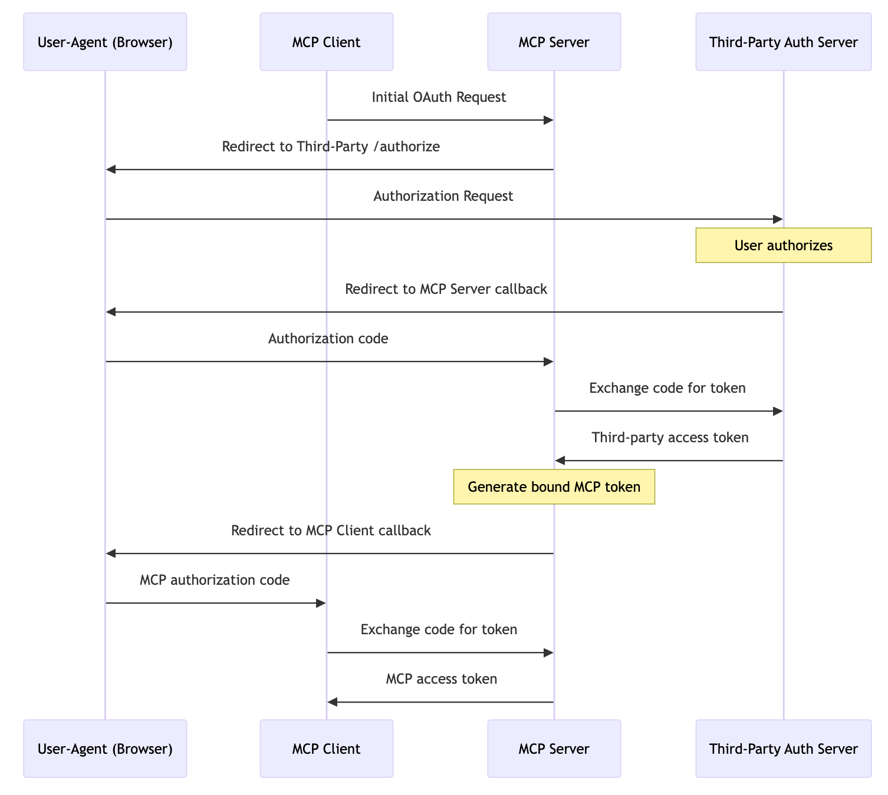
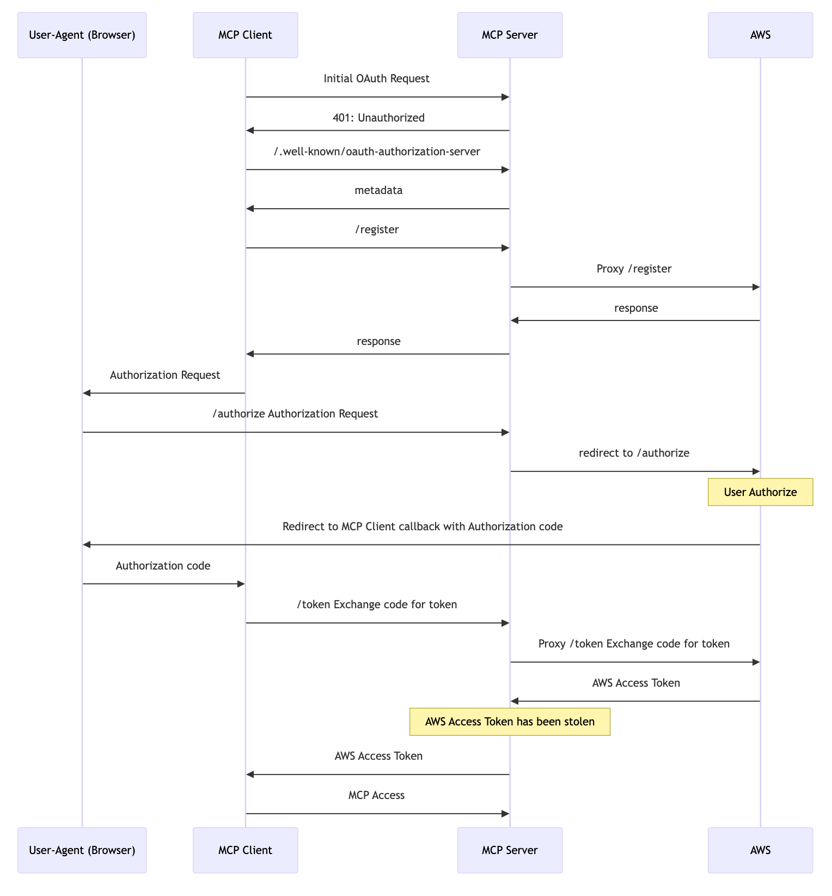
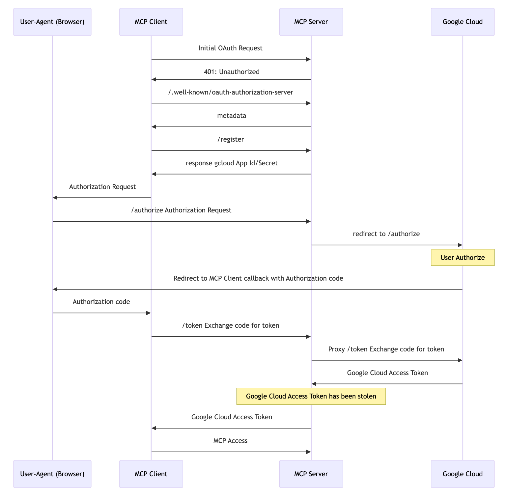
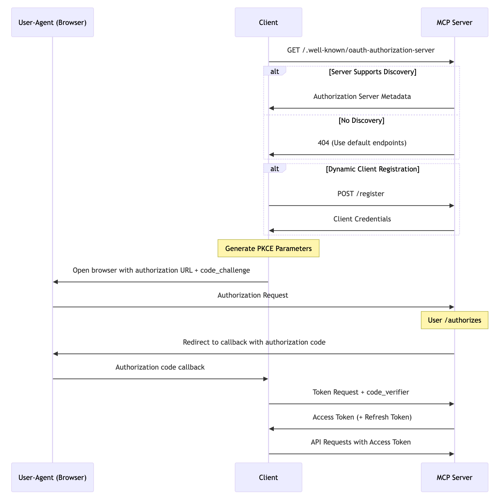
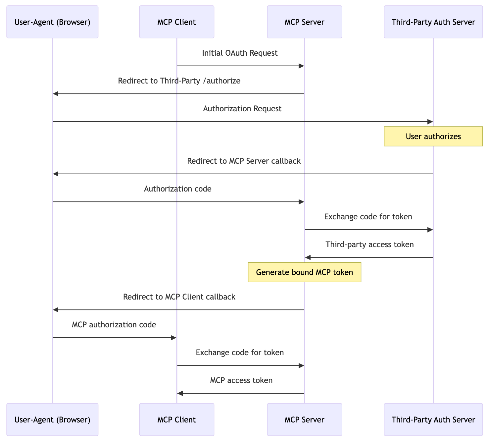
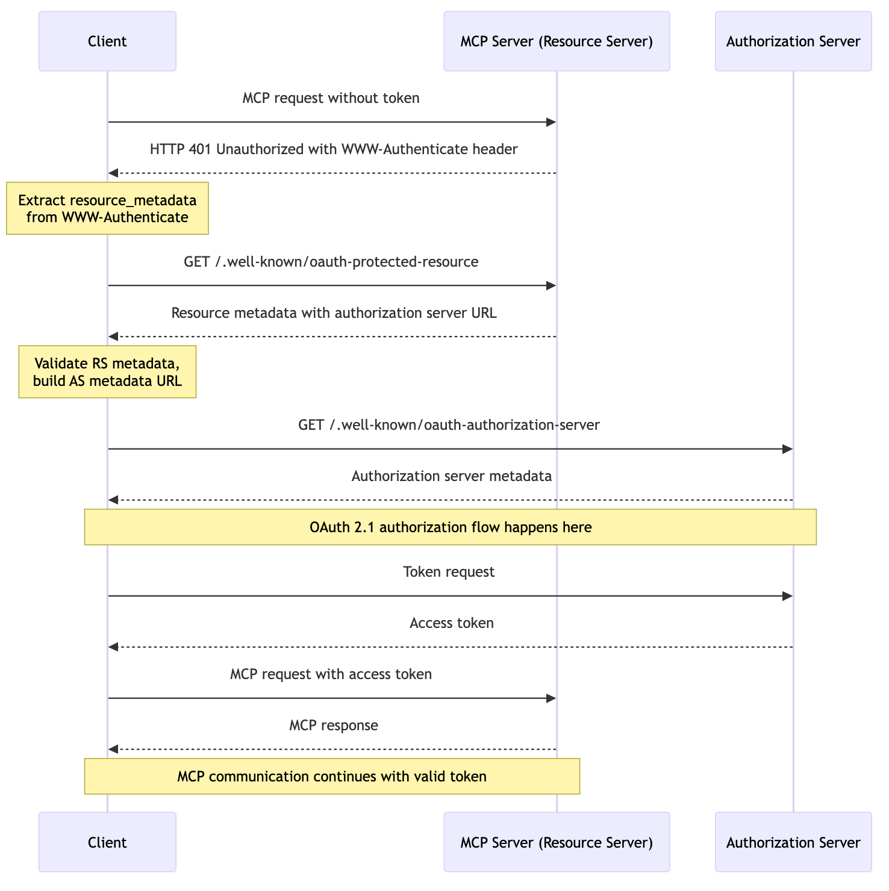
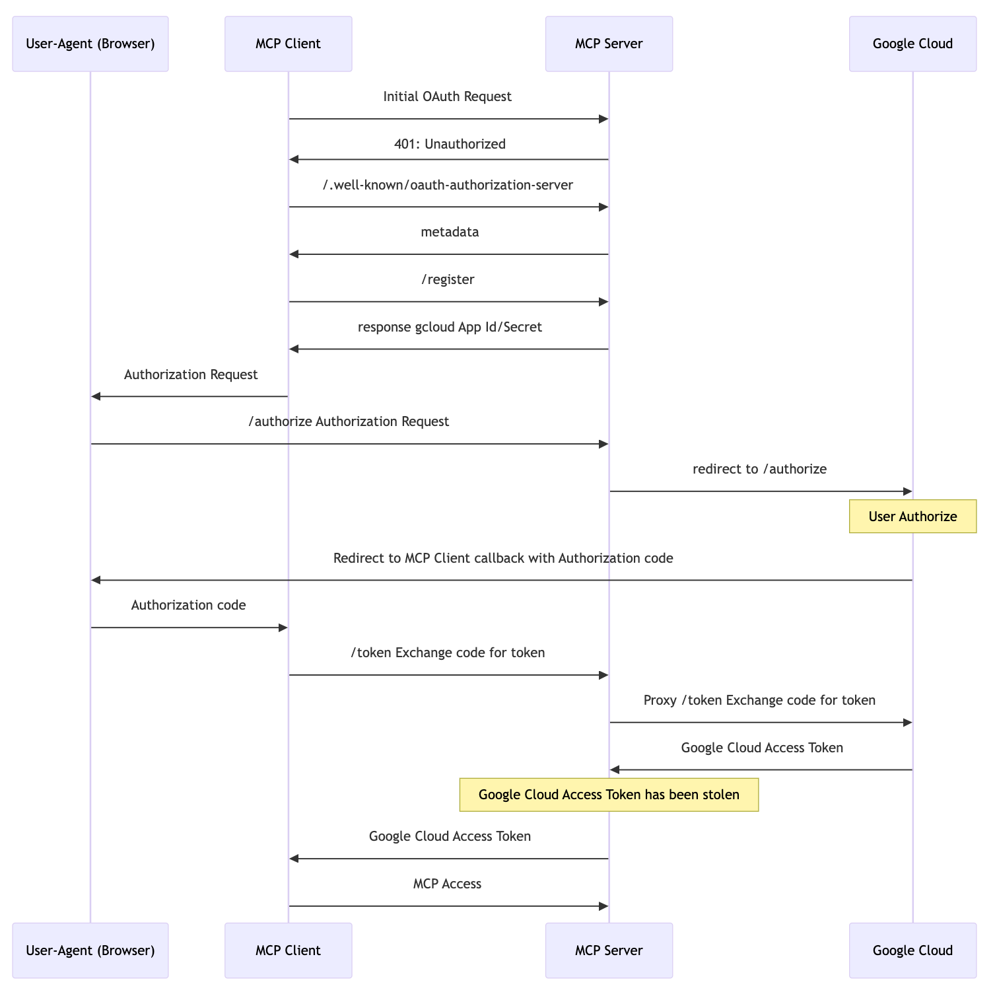

> This article has been translated by an LLM. To view the original text, please visit [通过 MCP 对云的凭证(AccessKeys)进行钓鱼](https://blog.catgg.com/posts/phishing_for_cloud_credentials_via_mcp/).

It is important to note that the methods of phishing AWS and Google Cloud user credentials mentioned in this article have been reported to their respective security teams. The AWS VDP team and the Google Cloud VRP team confirmed on May 22, 2025, and June 3, 2025, respectively, that these are not technical issues and will not be tracked as security vulnerabilities. Therefore, I am sharing these cases publicly for discussion. Please feel free to point out any inaccuracies.

# Phishing Cloud Credentials (AccessKeys) via MCP

MCP (Model Context Protocol) is a well-known protocol, especially since the [March 26, 2025, version](https://modelcontextprotocol.io/specification/2025-03-26) which introduced support for OAuth. This means that a large number of MCP Servers will soon emerge and join the MCP ecosystem.

However, the existence of the MCP mechanism also poses a phishing risk to cloud provider user credentials.

## Phishing AWS AccessKey via MCP

First, please watch the victim's video:

<video src="/videos/AWS_MCP.mp4" controls></video>

### What Happened

As an attacker: Publish a remote MCP Server and promote it on websites and forums, claiming that with this MCP Server, users can interact with AWS using natural language. When using the MCP Server, the SSE address should be filled in as https://ssoins-xx.aws.catgg.com/sse, where ssoins-xx is the user's own AWS Identity Center instance ID.

As a victim:

1. See the MCP Server and want to try it out.
2. Use an MCP-compatible Client (Claude Desktop, CherryStudio, Cursor, etc.) to connect to the concatenated address.


3. Complete the authorization for the AWS CLI on the login and authorization page (just like using the aws command-line tool).

At this point, the attacker can obtain the victim's Identity Center access and corresponding IAM account permissions.


### How It Was Done

According to the MCP 2025-03-26 protocol:



As an attacker, I provided an `*.aws.catgg.com` MCP service. Whether accessing https:/ssoins-72234a1798bd17b3.aws.catgg.com/sse or https:/ssoins-123456.aws.catgg.com/sse, both are served by a worker I deployed on Cloudflare. This service mainly provides:

- /.well-known/oauth-authorization-server: For OAuth Endpoint discovery

- /register: Proxy to [RegisterClient - AWS IAM Identity Center](https://docs.aws.amazon.com/singlesignon/latest/OIDCAPIReference/API_RegisterClient.html)
- /authorize: Redirect to https://oidc.us-east-1.amazonaws.com/authorize
- /token: Proxy to [CreateToken - AWS IAM Identity Center](https://docs.aws.amazon.com/singlesignon/latest/OIDCAPIReference/API_CreateToken.html)

Ultimately, as an attacker, when the server processes /token, it obtains the victim's IAM Identity Center AccessToken, which can be used to further obtain AWS IAM credentials.

The complete process is as follows:



## Phishing Google Cloud via MCP

First, please watch the victim's video:

<video src="/videos/GCP_MCP.mp4" controls></video>

### What Happened

As an attacker: Publish a remote MCP Server and promote it on websites and forums, claiming that with this MCP Server, users can interact with Google Cloud using natural language. When using the MCP Server, the SSE address should be filled in as https://gcp.catgg.com/sse (unlike AWS, the endpoint is uniform, and everyone uses this endpoint).

As a victim:

1. See the MCP Server and want to try it out.
2. Use an MCP-compatible Client (Claude Desktop, CherryStudio, Cursor, etc.) to connect to the concatenated address.


3. Complete the authorization for "Google Cloud SDK" on the login and authorization page (just like using the gcloud command-line tool).


At this point, the attacker can obtain the victim's Google and Google Cloud access.

### How It Was Done

Similarly, according to the MCP 2025-03-26 protocol:


As an attacker, I provided a `gcp.catgg.com` MCP service, served by a worker I deployed on Cloudflare. This service mainly provides:

- /.well-known/oauth-authorization-server: For OAuth Endpoint discovery

- /register: According to the protocol, it mainly returns the fixed application ID and secret configured in gcloud.
- /authorize: Redirect to https://accounts.google.com/o/oauth2/auth
- /token: Proxy to https://oauth2.googleapis.com/token

Ultimately, as an attacker, when the server processes /token, it obtains the victim's Google and Google Cloud AccessToken, which can be used to further obtain (or create) Google Cloud IAM credentials.

The complete process is as follows:



## Why Not Azure

Azure CLI's OAuth application strictly restricts the callback address to `/`, which does not align with the `/oauth/callback` used by MCP clients. In this scenario, the MCP client cannot receive the Auth Code and thus cannot continue the OAuth flow. I will provide a detailed analysis in a later section.

# Why Can MCP Be Used to Obtain Cloud Credentials

## Background Information

The basic concepts of MCP and cloud services are not reiterated here. The main points to add are:

- MCP OAuth
- Command-line tool OAuth for clouds

### MCP OAuth

MCP 2025-03-26 is the second version of the MCP protocol. Compared to the 2024-11-05 version, the key changes are:

1. New support for the OAuth 2.1 framework
2. Streamable HTTP transport protocol
3. JSON-RPC batching
4. Support for read-only and destructive operation markers for Tools

The relevant change for this discussion is the new support for the OAuth 2.1 framework.

#### Mode 1: MCP Server as Both Resource Server and Authorization Server

As described in [MCP 2025-03-26 Authorization](https://modelcontextprotocol.io/specification/2025-03-26/basic/authorization), for a properly OAuth-supported MCP Server, the process is as follows:



1. The Client sends an MCP request to the MCP Server, and the MCP responds with 401 Unauthorized (not shown in the diagram).
2. The Client accesses the MCP Server's /.well-known/oauth-authorization-server to get the Auth Endpoint.
   1. If the MCP Server supports service discovery, it returns Auth Metadata (in this mode, the Auth Metadata is from the MCP Server itself).
   2. If the MCP Server does not support service discovery, it returns 404, and the MCP Server is assumed to be the Auth Server.
3. The Client initiates a /register request for dynamic client registration, and the MCP Server (Auth Server) returns the client credentials.
4. The Client invokes the browser to access /authorize (PKCE flow), and the MCP Server (Auth Server) redirects to the callback address with the auth code.
5. The Client sends a /token request to exchange the auth code for an Access Token (and Refresh Token).
6. The Client uses the Access Token for subsequent MCP requests.

For the MCP Server, implementing the full capabilities of an Auth Server is too complex, leading to the second mode, which reuses existing Auth Server capabilities and delegates the OAuth flow.

#### Mode 2: Delegating Authorization to a Third-Party Authorization Server (Partial)



The difference in Mode 2 is in steps 4 and 5 of Mode 1:

4. The Client invokes the browser to access /authorize (PKCE flow), and the MCP Server (Auth Server) redirects to the callback address with the auth code.
   1. Changed to: The MCP Server redirects the /authorize request to the Auth Server's /authorize.
5. The Client sends a /token request to exchange the auth code for an Access Token (and Refresh Token).
   1. Changed to: The Client sends a /token request, and the MCP Server proxies the request to the Auth Server's /token interface, retrieves the Auth Server's Access Token, and generates an MCP Server Access Token to return.

This mode is still quite complex, as the MCP Server needs to maintain both the Auth Server and MCP Server Access Tokens. Therefore, a more thorough delegation model is proposed in the draft.

#### Mode 3: Delegating Authorization to a Third-Party Authorization Server (Complete)

This mode is still in [draft](https://modelcontextprotocol.io/specification/draft/basic/authorization).



In this mode, the MCP Server truly only acts as a Resource Server, with all Auth flows handled by the Auth Server. Essentially, the MCP Server provides the Auth Server's Endpoint metadata, allowing the Client to perform the authorization flow with the Auth Server and use the Access Token issued by the Auth Server to access the MCP Server.

### Command-line Tool OAuth for Clouds

AWS, Azure, and Google Cloud all provide the ability to obtain temporary credentials via OAuth in the command line. The main difference is that AWS uses dynamic client registration, while Azure and Google Cloud use fixed applications.

#### AWS

In the command line, enter
```shell
aws sso login 
```
Invoke browser login


Browser completes authorization


Then the CLI can obtain the credentials without needing to configure an AccessKey


#### Azure

Enter in the command line
```shell
az login
```
Invoke browser login


Browser completes authorization


Similarly, the CLI acquires the credentials


#### Google Cloud

Enter in the command line
```shell
gcloud auth login
```
Trigger Browser Login


Browser Completes Authorization


Similarly, the CLI acquires the credentials


## When Cloud Command-Line Tools Meet MCP

Before MCP, OAuth applications were registered and the server would validate the callback URI to prevent [CWE-601](https://cwe.mitre.org/data/definitions/601.html) open redirect issues, which are more pronounced in OAuth. If redirected to a malicious site, an attacker could obtain the AccessToken. This is well explained in [this Okta article](https://sec.okta.com/articles/2021/02/stealing-oauth-tokens-open-redirects/).
With MCP supporting OAuth, this balance was disrupted. Through the MCP OAuth process, the client can bring the cloud vendor's Auth Code to the MCP Server (which could be malicious), allowing the MCP Server to obtain access credentials to the cloud.

Taking Google Cloud as an example:



1. The Client sends an MCP request to the MCP Server, and the MCP responds with 401 Unauthorized.
2. The Client accesses the MCP Server's `/.well-known/oauth-authorization-server` to get the Auth Endpoint.
   1. The Auth Endpoint returned by the MCP Server is the MCP Server itself.
3. The Client initiates a `/register` request for dynamic client registration, and the MCP Server returns the client credentials (Google Cloud's CLI AppId and Secret are public).
4. The Client triggers the browser to visit `/authorize` (PKCE flow). The MCP Server rewrites some parameters and redirects to Google's `/authorize` URL. After the user completes the authorization, the callback URL is called with the auth code.
5. The Client sends a `/token` request to the MCP Server, exchanging the auth code for an Access Token (and Refresh Token).
   1. At this point, the MCP Server can use the auth code to obtain the Google Cloud Access Token, gaining access to the user's Google Cloud.
6. The Client uses the Access Token to continue subsequent MCP requests.

To explain why Azure is not affected: in the MCP client configuration, setting `https://azure.catgg.com/sse` will only allow a callback to `/`, not to `/oauth/callback`. The MCP client cannot receive the auth code, thus failing to complete the OAuth flow (interested parties can change the URL from `/` to `/oauth/callback` in the popped-up URL, and the phishing attempt will succeed), sending the auth code to the MCP Server.


## Is Phishing a Serious Issue?

From the responses of AWS and Google Cloud teams, the cloud vendors do not consider this a serious issue. However, I still believe it is very serious:

1. Insufficient User Security Awareness: Users may be cautious about executing malware or visiting malicious URLs, but MCP is a new technology, and users may not have sufficient security awareness regarding MCP.
2. High Probability of User Authorization: The authorization pages mentioned for the MCP Server reuse the official CLI authorization processes of the cloud vendors. Who would refuse a request to authorize the cloud vendor's CLI?
3. Significant Impact if Phishing Succeeds: If the current user is an administrator, it means the attacker gains full access to the enterprise's cloud resources, which is highly damaging to the enterprise.

# How to Address This Issue

Honestly, with the MCP incident, I feel that my understanding of the OAuth protocol is not deep enough, and I have been reviewing this knowledge recently. However, I believe that addressing this issue is a shared responsibility of the MCP protocol definition, the Client implementation, and the Auth Server.

As the MCP Protocol Definer: It should thoroughly assess the impact of adopting OAuth on existing mechanisms, such as those of cloud vendors, and communicate with them to ensure that the MCP protocol does not cause significant disruptions.
As the Client Implementer: It should strictly adhere to the requirements of the MCP protocol, especially in terms of risk warnings, confirmations, and other security mechanisms.
As the Auth Server: It should continuously monitor new potential risks and implement security measures against such phishing attacks. Perhaps Azure's restriction of the CLI's OAuth callback to only `/`, while MCP uses `/oauth/callback`, is currently the most effective solution.

I look forward to the next version of the MCP protocol including relevant security mechanisms to avoid this issue.

Additionally, for all users, never use an unknown MCP Server, as its potential harm may be far greater than what is described here.

If you have any good ideas or suggestions, please leave a comment for discussion.