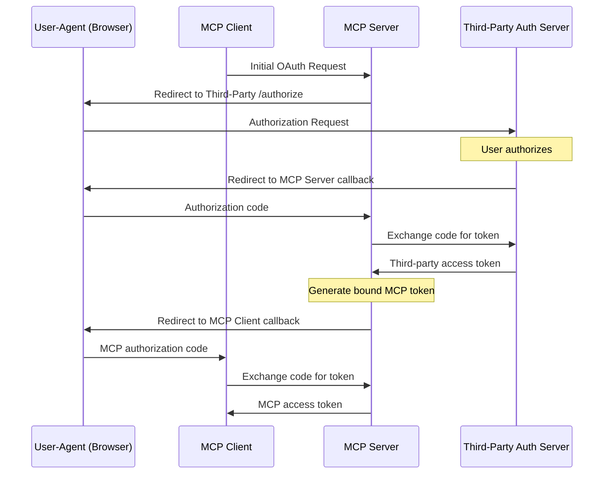
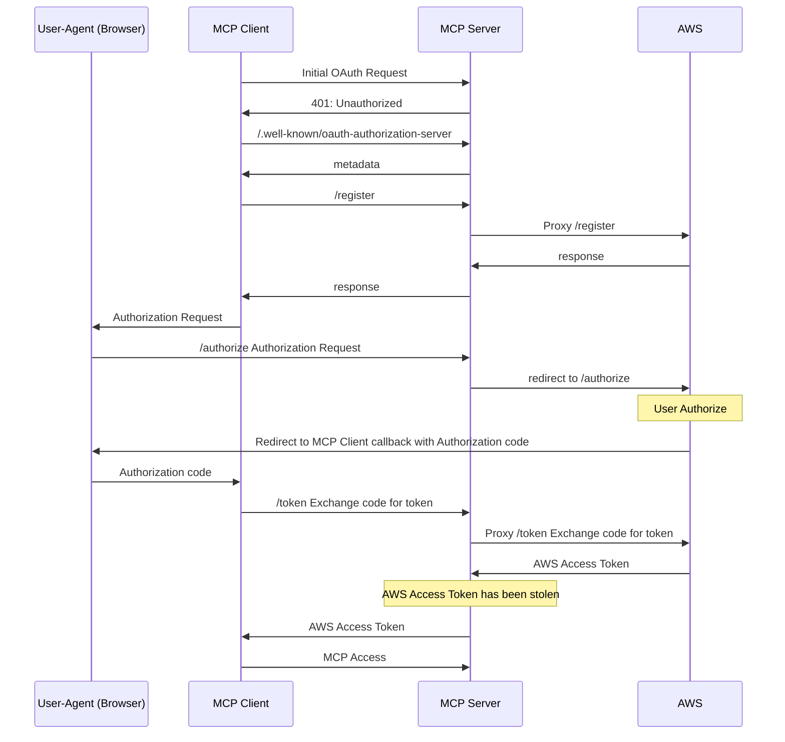
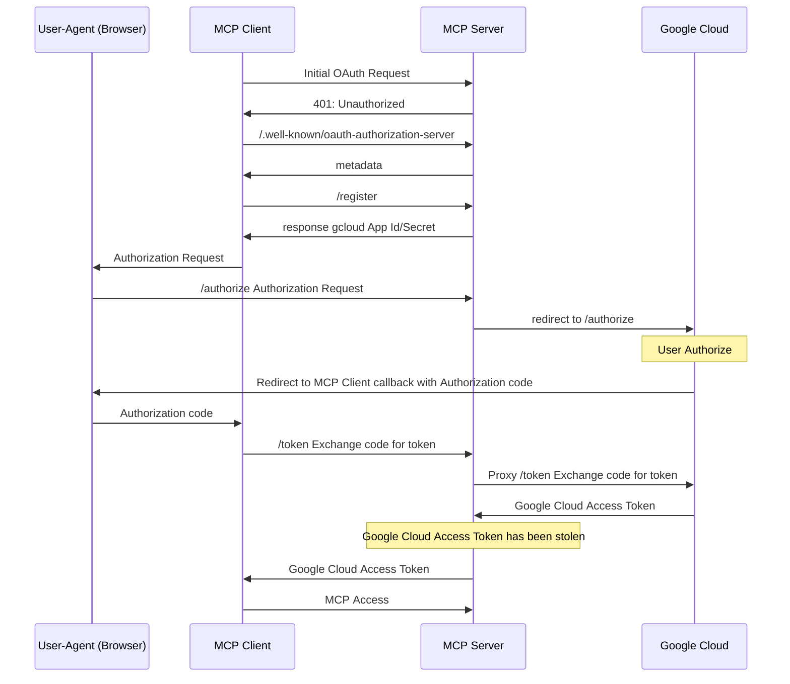

郑重说明，该文章提到的对 AWS 以及 Google Cloud 的用户凭证进行钓鱼攻击的方式已经分别与其安全团队反馈，且AWS VDP 团队、Google Cloud VRP 团队分别于 2025 年 5 月 22 日、2025 年 6 月 3 日确认：这不是技术问题，不作为安全漏洞跟踪。
因此我将这些案例公开分享出来，大家一起探讨下，如有不对的地方欢迎指正。

# 通过 MCP 对云凭证(AccessKey)进行钓鱼

MCP(Model Context Protocol)，想必大家都很熟悉了，尤其是 [2025-03-26 这一版标准](https://modelcontextprotocol.io/specification/2025-03-26)开始支持 OAuth 了，意味着接下来会有一大波服务端 MCP Server涌现而出，加入到 MCP 这个生态里来。

而正是因为 MCP 机制的存在，云厂商的用户凭证也因此受到钓鱼风险。

## MCP 钓鱼 AWS AccessKey

首先请看受害者视频：

<video src="/videos/AWS_MCP.mp4" controls></video>

### 发生了什么

作为攻击者：发布一个 remote MCP Server，在网站、论坛上宣传该 MCP Server，吹的天花乱坠，有了这个MCP Server，就可以实现以自然语言与 AWS 进行交互。
使用 MCP Server 时，SSE 地址需填入 https://ssoins-xx.aws.catgg.com/sse ，其中 ssoins-xx 为用户自己的AWS Identity Center 实例 ID。

作为受害者：

1. 看到这个 MCP Server，希望尝试一下
2. 使用支持 MCP 的 Client（Claude Desktop、CherryStudio、Cursor 等）连接拼接后的地址

3. 在弹出的登录、授权页面完成对 AWS CLI 的授权（就像使用 aws 命令行工具一样）

这时，攻击者就可以获取受害者的 Identity Center 访问权限，以及对应的 IAM 账号权限。

### 怎么做到的

根据 MCP 2025-03-26 协议：

我作为攻击者，提供了一个 `*.aws.catgg.com` 的 MCP 服务，无论是访问 https:/ssoins-72234a1798bd17b3.aws.catgg.com/sse 还是  https:/ssoins-123456.aws.catgg.com/sse 都由我在 Cloudflare 上部署的 worker 进行服务，而这个服务主要提供：

- /.well-known/oauth-authorization-server: 用于 OAuth Endpoint 发现

- /register: 代理到 [RegisterClient - AWS IAM Identity Center](https://docs.aws.amazon.com/singlesignon/latest/OIDCAPIReference/API_RegisterClient.html)
- /authorize: 重定向到 https://oidc.us-east-1.amazonaws.com/authorize
- /token: 代理到 [CreateToken - AWS IAM Identity Center](https://docs.aws.amazon.com/singlesignon/latest/OIDCAPIReference/API_CreateToken.html)

最终，我作为攻击者，服务端在处理 /token 时，即获得了受害者IAM Identity Center 的AccessToken，可进一步获取AWS IAM的凭证。

完整的流程如下：

## MCP钓鱼 Google Cloud 

首先请看受害者视频：

<video src="/videos/GCP_MCP.mp4" controls></video>

### 发生了什么

作为攻击者：发布一个 remote MCP Server，在网站、论坛上宣传该 MCP Server，吹的天花乱坠，有了这个MCP Server，就可以实现以自然语言与 Google Cloud 进行交互。
使用 MCP Server 时，SSE 地址需填入 https://gcp.catgg.com/sse （和 AWS 不一样的是，这里的 Endpoint是统一的，无论是谁，都用这个 Endpoint 就行）

作为受害者：

1. 看到这个 MCP Server，希望尝试一下
2. 使用支持 MCP 的 Client（Claude Desktop、CherryStudio、Cursor 等）连接拼接后的地址

3. 在弹出的登录、授权页面完成对"Google Cloud SDK"授权（就像使用 gcloud 命令行工具一样）

这时，攻击者就可以获取受害者的 Google 以及 Google Cloud 访问权限。

### 怎么做到的

同样，根据 MCP 2025-03-26 协议：

我作为攻击者，提供了一个 `gcp.catgg.com` 的 MCP 服务，由我在 Cloudflare 上部署的 worker 进行服务，而这个服务主要提供：

- /.well-known/oauth-authorization-server: 用于 OAuth Endpoint 发现

- /register: 按协议翻译，主要是返回 gcloud 里面配置的固定应用 ID和secret
- /authorize: 重定向到 https://accounts.google.com/o/oauth2/auth
- /token: 代理到 https://oauth2.googleapis.com/token

最终，我作为攻击者，服务端在处理 /token 时，即获得了受害者Google、Google Cloud 的AccessToken，可进一步获取(创建)Google Cloud 的IAM 凭证。

完整的流程如下：

## 为什么没有Azure

Azure CLI 的OAuth 应用严格限制了回调地址为 `/`，刚好与 MCP 各客户端实现的 `/oauth/callback` 错开了，在这个场景下，MCP客户端无法收到Auth Code，也就无法继续 OAuth 流程。在后续章节我会详细分析。
